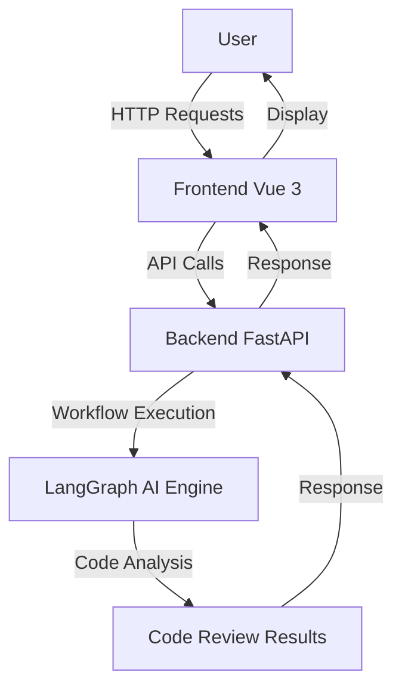

# Architecture Guide

This document describes the architecture and directory structure of the YiCe project.

## Directory Structure

```
YiCe/
├── backend/                 # Backend application
│   ├── app/
│   │   ├── api/            # API routes
│   │   ├── core/           # Core configuration and utilities
│   │   ├── models/         # Data models
│   │   ├── services/       # Business logic
│   │   ├── workflows/      # LangGraph workflows
│   │   └── main.py         # FastAPI application entry point
│   ├── tests/              # Backend tests
│   ├── pyproject.toml      # Python dependencies
│   └── .env.example        # Environment variables example
├── frontend/                # Frontend application
│   ├── src/
│   │   ├── api/            # API client
│   │   ├── components/     # Reusable Vue components
│   │   ├── router/         # Vue Router configuration
│   │   ├── stores/         # Pinia state management
│   │   ├── views/          # Page components
│   │   ├── App.vue         # Root component
│   │   └── main.ts         # Application entry point
│   ├── tests/              # Frontend tests
│   ├── package.json        # Node.js dependencies
│   └── .env.example        # Environment variables example
├── docs/                    # Documentation
├── scripts/                 # Utility scripts
└── README.md               # Project README
```

## Tech Stack Details

### Backend
- **FastAPI**: High-performance web framework for building APIs with Python 3.7+
- **LangGraph**: Framework for building stateful, multi-actor applications with LLMs
- **Pydantic**: Data validation using Python type annotations
- **Uvicorn**: Lightning-fast ASGI server implementation

### Frontend
- **Vue 3**: Progressive JavaScript framework for building user interfaces
- **TypeScript**: Typed superset of JavaScript that compiles to plain JavaScript
- **Vite**: Next-generation frontend tooling for fast development
- **Pinia**: Intuitive, type safe store for Vue
- **Vue Router**: Official router for Vue.js applications

## Architecture Overview

YiCe follows a modern client-server architecture:

1. **Frontend**: Single-page application (SPA) built with Vue 3
2. **Backend**: RESTful API built with FastAPI
3. **AI Engine**: LangGraph-based workflows for code review


