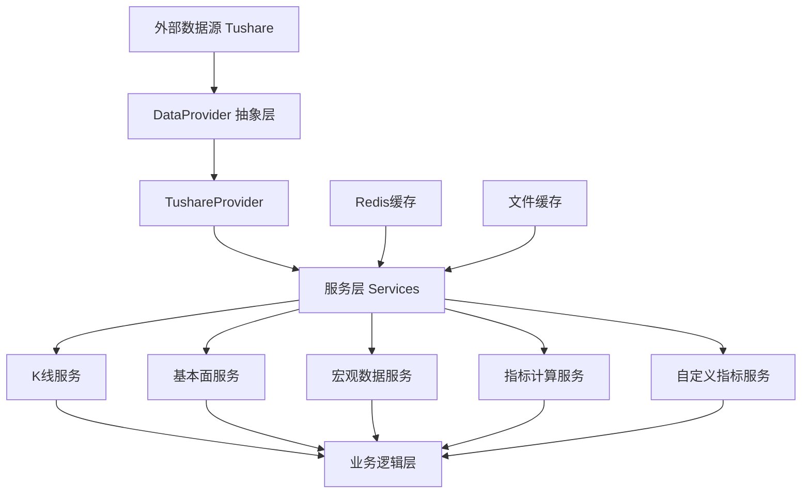

# 数据层架构文档

本文档描述了 YiCe 项目的数据层架构，包括数据提供者、服务层、缓存机制和技术指标计算。

## 概述

YiCe 的数据层负责从外部数据源获取金融数据，并提供统一的接口供上层业务使用。数据层采用模块化设计，支持多种数据源，内置缓存机制，并提供丰富的技术指标计算功能。

## 架构图



## 核心组件

### 1. 数据提供者 (DataProvider)

数据提供者是数据层的抽象接口，定义了获取金融数据的标准方法。

#### DataProvider 抽象类
```python
class DataProvider(ABC):
    @abstractmethod
    async def get_kline(symbol, start_date, end_date, period) -> List[KlineData]
    @abstractmethod
    async def get_fundamental(symbol) -> Optional[FundamentalData]
    @abstractmethod
    async def search_symbol(keyword) -> List[str]
```

#### TushareProvider 实现
- 基于 Tushare Pro API 实现
- 支持 K线数据（日K、周K、月K）
- 支持基本面数据（PE、PB、市值等）
- 支持股票代码搜索
- 内置频率控制（每分钟不超过200次请求）

### 2. 数据源工厂 (DataSourceFactory)

工厂模式用于创建和管理不同的数据提供者实例。

```python
class DataSourceFactory:
    @staticmethod
    def get_provider(provider_name="tushare") -> Optional[DataProvider]
```

当前支持的提供者：
- **tushare**: Tushare Pro API（主要数据源）
- **akshare**: AKShare 数据源（预留）
- **jqdata**: 聚宽数据源（预留）

### 3. 服务层 (Services)

服务层封装了具体的业务逻辑，提供高级数据访问接口。

#### K线数据服务 (KlineDataService)
- 获取日K、周K、月K数据
- 内置重试机制（最多3次）
- 指数退避等待策略
- 频率限制保护

#### 基本面数据服务 (FundamentalDataService)
- 财务报表数据（资产负债表、利润表、现金流量表）
- 公司基本信息
- 行业分类数据
- 支持多种报告类型和周期

#### 宏观数据服务 (MacroDataService)
- GDP 数据
- CPI 消费者价格指数
- PPI 生产者价格指数
- 利率数据（SHIBOR）
- 货币供应量（M0、M1、M2）

#### 技术指标服务 (IndicatorService)
- 基于 pandas-ta-classic 库
- 支持 30+ 常用技术指标
- 分类：趋势指标、动量指标、成交量指标、波动率指标
- 详细列表见 [指标列表文档](indicators_list.md)

#### 自定义指标服务 (CustomIndicatorManager)
- 允许用户定义自己的技术指标
- 使用 Python 表达式语法
- AST 解析验证安全性
- 支持注册、管理和执行自定义指标

### 4. 缓存层 (Cache)

统一缓存接口，支持 Redis 和本地文件缓存自动降级。

#### 缓存策略
1. **Redis 缓存**（优先）：内存缓存，支持 TTL
2. **文件缓存**（降级）：本地磁盘缓存，持久化存储
3. **自动降级**：Redis 不可用时自动切换到文件缓存

#### 缓存组件
- `Cache` 类：统一缓存接口
- `RedisClient`：Redis 客户端封装
- `file_cache`：本地文件缓存实现

### 5. 数据模型 (Data Models)

#### KlineData
- symbol: 股票代码
- timestamp: 时间戳
- open/high/low/close: 开盘/最高/最低/收盘价
- volume/amount: 成交量/成交额

#### FundamentalData
- symbol: 股票代码
- name: 公司名称
- pe_ratio: 市盈率
- pb_ratio: 市净率
- market_cap: 市值
- total_shares: 总股本
- float_shares: 流通股本

## 数据流示例

### 获取日K线数据
```
用户请求 → KlineDataService → DataSourceFactory → TushareProvider → Tushare API
```

### 计算技术指标
```
K线数据 → IndicatorService → pandas-ta-classic → 指标结果
```

### 缓存流程
```
数据请求 → 检查Redis缓存 → 命中则返回 → 未命中则查询数据源 → 写入Redis和文件缓存 → 返回数据
```

## 配置要求

### 环境变量
```bash
# Tushare 配置
TUSHARE_TOKEN=你的Tushare Pro令牌

# Redis 配置（可选）
REDIS_HOST=localhost
REDIS_PORT=6379
REDIS_DB=0
REDIS_PASSWORD=
```

### 依赖库
```toml
tushare = "^1.2.89"
pandas-ta-classic = "^0.2.0b0"
redis = "^5.0.0"
pandas = "^2.0.0"
tenacity = "^8.2.0"
```

## 扩展性设计

### 添加新的数据提供者
1. 继承 `DataProvider` 抽象类
2. 实现所有抽象方法
3. 在 `DataSourceFactory` 中注册
4. 添加相应的环境变量配置

### 添加新的技术指标
1. 在 `IndicatorService` 中添加新的静态方法
2. 使用 `pandas-ta-classic` 的对应函数
3. 更新指标列表文档

### 自定义指标表达式
支持使用 Python 表达式定义指标，例如：
- `(close - open) / open * 100`  # 日涨跌幅
- `(high - low) / close`         # 日波动率
- `volume > 1000000`             # 成交量筛选

## 故障处理

### 常见问题
1. **Tushare API 限制**：内置频率控制和重试机制
2. **网络连接问题**：指数退避重试策略
3. **Redis 不可用**：自动降级到文件缓存
4. **数据格式变化**：通过 `DataConverter` 统一转换

### 监控和日志
- 详细的操作日志记录
- 错误异常分类处理
- 缓存命中率统计（预留）

## 性能考虑

1. **缓存优化**：高频数据优先使用 Redis 缓存
2. **批量请求**：支持批量获取数据减少 API 调用
3. **异步操作**：全异步设计提高并发性能
4. **内存管理**：大数据集分页处理

---

*本文档最后更新日期：2025-04-13*